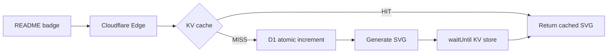

<div align="center">


<br>

[](LICENSE)
[](https://github.com/tashfiqul-islam/profile-view-counter/actions/workflows/ci.yml)
[](#testing)
[](https://www.typescriptlang.org/)
[](https://hono.dev)

<br>

A **blazing-fast, edge-deployed** profile view counter for GitHub READMEs.

Built on **Cloudflare Workers** with **D1** for persistence, **KV** for caching, and **Hono** for routing.

<br>

[](https://github.com/tashfiqul-islam/profile-view-counter)

*Click the badge above to see it in action*

</div>

---

## Quick Start

Add this to your GitHub profile `README.md`:

```markdown
[](https://github.com/tashfiqul-islam/profile-view-counter)
```

<details>
<summary>HTML alternative</summary>

```html
<a href="https://github.com/tashfiqul-islam/profile-view-counter">
  
</a>
```

</details>

> [!NOTE]
> Replace `YOUR_USERNAME` with your GitHub username.

---

## How It Works



Every visit to a README embedding the badge triggers an edge request. On cache miss, the view count is atomically incremented in D1, a fresh SVG is generated, and the result is cached in KV for 60 seconds. Cache writes are non-blocking and error-safe via `waitUntil()`.

---

## Features

| Feature | Detail |
|---------|--------|
| **Edge-first** | Global deployment with [Smart Placement](https://developers.cloudflare.com/workers/configuration/smart-placement/) for optimal D1 latency |
| **Atomic counting** | `INSERT ON CONFLICT ... RETURNING` — zero race conditions |
| **Sub-10ms cache** | KV-backed edge cache, 60s TTL |
| **Responsive SVG** | `viewBox` + `preserveAspectRatio` — crisp at any size |
| **Accessible** | WCAG: `role="img"`, `aria-labelledby`, `<title>`, `<desc>` |
| **Secure** | `secureHeaders()` (HSTS, CSP, X-Frame-Options) + `nosniff` on SVG |
| **Observable** | `requestId()` tracing, structured JSON logging, source maps |
| **100% tested** | `bun:test` units + Vitest workerd integration |
| **Type-safe** | TypeScript 7 strict + Valibot schema validation |

---

## Architecture

```
src/
├── index.ts              # Hono app, typed Variables, secureHeaders(DENY/CSP/HSTS), structured logging
├── routes/
│   └── view-counter.ts   # Cache-first badge endpoint
├── badge/
│   └── generator.ts      # Responsive SVG with a11y
├── services/
│   ├── counter.ts        # D1 atomic increment
│   └── cache.ts          # KV get/set with TTL
└── schemas/
    └── query.ts          # Valibot validation with description metadata
```

> [!TIP]
> Full architecture docs with Mermaid diagrams: [ARCHITECTURE.md](src/docs/ARCHITECTURE.md)

---

## Tech Stack

| Layer | Technology | Role |
|-------|-----------|------|
| **Runtime** | [Bun](https://bun.sh) | Package manager, script runner, unit test runner |
| **Edge** | [Cloudflare Workers](https://workers.cloudflare.com) | Global deployment with Smart Placement |
| **Framework** | [Hono](https://hono.dev) | Ultra-lightweight routing + middleware |
| **Database** | [Cloudflare D1](https://developers.cloudflare.com/d1/) | Serverless SQLite with atomic operations |
| **Cache** | [Cloudflare KV](https://developers.cloudflare.com/kv/) | Distributed key-value store (60s TTL) |
| **Validation** | [Valibot](https://valibot.dev) | Tree-shakeable schema validation |
| **Language** | [TypeScript](https://www.typescriptlang.org/) | Strict mode, `erasableSyntaxOnly` |
| **Lint/Format** | [Ultracite](https://github.com/haydenbleasel/ultracite) | Opinionated Biome preset |
| **Unit Tests** | [bun:test](https://bun.sh/docs/cli/test) | Built-in runner with V8 coverage |
| **Integration** | [Vitest](https://vitest.dev) + [pool-workers](https://developers.cloudflare.com/workers/testing/vitest-integration/) | Workerd runtime testing |
| **CI/CD** | [GitHub Actions](https://github.com/features/actions) + [Semantic Release](https://semantic-release.gitbook.io/) | Automated quality gates + versioning |

---

## API

| Endpoint | Method | Description |
|----------|--------|-------------|
| `/` | GET | API info and available endpoints |
| `/health` | GET | Health check (`{ status: "ok" }`) |
| `/api/view-counter?username=:username` | GET | Generate badge and increment count |

> Full API reference: [API.md](src/docs/API.md)

---

## Development

### Prerequisites

- [Bun](https://bun.sh) — see `engines.bun` in `package.json`
- [Cloudflare account](https://dash.cloudflare.com/sign-up) (free tier)

### Setup

```bash
git clone https://github.com/tashfiqul-islam/profile-view-counter.git
cd profile-view-counter
bun install
```

### Commands

| Command | Description |
|---------|-------------|
| `bun run dev` | Start local Workers dev server |
| `bun run test` | Run all tests (unit + integration) |
| `bun run test:unit` | Badge generator tests (`bun:test`) |
| `bun run test:integration` | Worker integration tests (Vitest + workerd) |
| `bun run check` | Lint + format check (Ultracite) |
| `bun run fix` | Auto-fix lint + format issues |
| `bun run typecheck` | TypeScript strict type checking |
| `bun run cf-typegen` | Regenerate types from `wrangler.jsonc` |
| `bun run deploy` | Deploy to Cloudflare Workers |
| `bun run commit` | Interactive conventional commit wizard |

### Testing

Tests are split across two runners for optimal performance:

- **`bun:test`** — badge generator unit tests with built-in V8 coverage
- **Vitest** — integration tests against the workerd runtime via `@cloudflare/vitest-pool-workers`

```bash
bun run test   # Runs both — must maintain 100% coverage
```

---

## Deployment

> Full step-by-step guide: [DEPLOYMENT.md](src/docs/DEPLOYMENT.md)

```bash
bunx wrangler login           # Authenticate with Cloudflare
bun run db:migrate:prod       # Apply D1 schema
bun run deploy                # Ship it
```

---

## Contributing

1. Fork and clone the repo
2. Create a feature branch: `git checkout -b feat/your-feature`
3. Make changes and verify:
   ```bash
   bun run test        # 100% coverage required
   bun run fix         # Auto-fix lint/format
   bun run typecheck   # Must pass
   ```
4. Commit: `bun run commit` (conventional commits enforced)
5. Push and open a PR

> [!IMPORTANT]
> All commits must follow [Conventional Commits](https://www.conventionalcommits.org/). See [CONTRIBUTING.md](CONTRIBUTING.md) for details.

---

<div align="center">

<a href="https://github.com/tashfiqul-islam">
  
</a>
<a href="https://x.com/_tashfiqulislam">
  
</a>

**Built with care by [Tashfiqul Islam](https://github.com/tashfiqul-islam)**

Licensed under MIT

</div>
