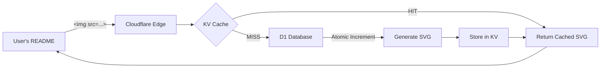
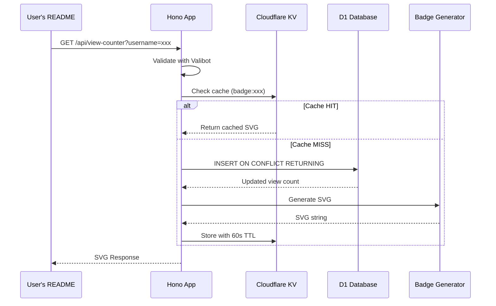

# Architecture Overview

> Technical deep-dive into the Profile View Counter system design.

---

## High-Level Flow



## Request Sequence



---

## Project Structure

```
src/
├── index.ts              # Hono app entry point, middleware, routes
├── routes/
│   └── view-counter.ts   # /api/view-counter route handler
├── badge/
│   └── generator.ts      # SVG badge generation logic
├── services/
│   ├── counter.ts        # D1 database operations
│   └── cache.ts          # KV cache operations
├── schemas/
│   └── query.ts          # Valibot validation schemas
├── types/
│   └── env.ts            # TypeScript type definitions
└── docs/
    ├── API.md            # API reference
    ├── ARCHITECTURE.md   # This file
    └── DEPLOYMENT.md     # Deployment guide
```

---

## Core Components

### 1. Entry Point (`index.ts`)

The Hono application configures:
- **Middleware**: `logger()`, `timing()`, `cors()`
- **Routes**: `/`, `/health`, `/favicon.ico`, `/api/*`
- **Error Handlers**: 404 and 500

```typescript
const app = new Hono<{ Bindings: Env }>()
export default app
```

### 2. Route Handler (`routes/view-counter.ts`)

Implements the cache-first pattern:

1. Validate query params with Valibot
2. Check KV cache for existing badge
3. If cache miss: increment D1 count, generate SVG, cache result
4. Return SVG with appropriate headers

### 3. Counter Service (`services/counter.ts`)

Uses atomic `INSERT ON CONFLICT` with `RETURNING`:

```sql
INSERT INTO view_counts (username, views, updated_at)
VALUES (?1, 1, datetime('now'))
ON CONFLICT(username) DO UPDATE SET
  views = views + 1,
  updated_at = datetime('now')
RETURNING views
```

### 4. Badge Generator (`badge/generator.ts`)

Creates a modern SVG badge with:
- 3D capsule design with rounded corners
- GitHub logo in a circular frame
- Dynamic view count formatting (K, M, B)
- Accessibility attributes (`role`, `aria-label`, `<title>`)

---

## Data Flow

| Step | Component | Action |
|------|-----------|--------|
| 1 | Hono Middleware | Log request, add timing headers, set CORS |
| 2 | Valibot Validator | Validate `username` query parameter |
| 3 | Cache Service | Check KV for cached badge |
| 4 | Counter Service | Atomic increment in D1 (if cache miss) |
| 5 | Badge Generator | Create SVG string |
| 6 | Cache Service | Store badge in KV with 60s TTL |
| 7 | Response | Return SVG with appropriate headers |

---

## Storage

### Cloudflare D1 (SQLite)

**Table: `view_counts`**

| Column | Type | Description |
|--------|------|-------------|
| `username` | TEXT (PK) | GitHub username |
| `views` | INTEGER | Total view count |
| `created_at` | TEXT | First view timestamp |
| `updated_at` | TEXT | Last view timestamp |

### Cloudflare KV

**Key Format**: `badge:{username}`
**Value**: SVG string
**TTL**: 60 seconds
