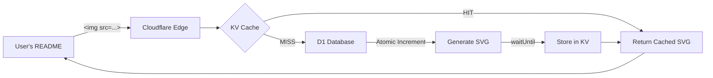
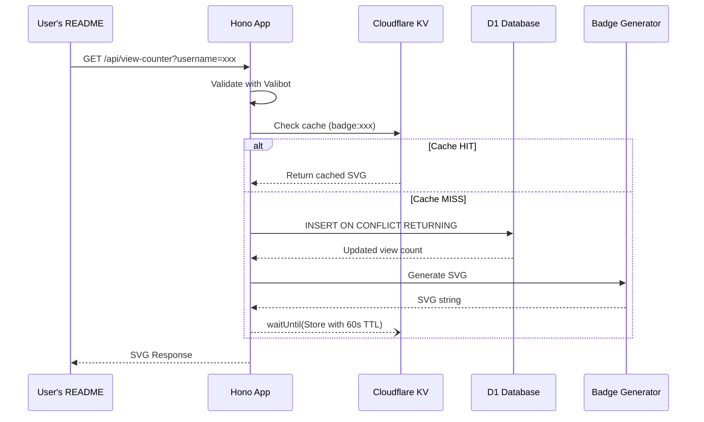

# Architecture Overview

> Technical deep-dive into the Profile View Counter system design.

---

## High-Level Flow


```mermaid
flowchart LR
    A[User's README] -->|"&lt;img src=...&gt;"| B[Cloudflare Edge]
    B --> C{KV Cache}
    C -->|HIT| D[Return Cached SVG]
    C -->|MISS| E[D1 Database]
    E -->|Atomic Increment| F[Generate SVG]
    F -->|waitUntil| G[Store in KV]
    G --> D
    D --> A
```

## Request Sequence


```mermaid
sequenceDiagram
    participant U as User's README
    participant H as Hono App
    participant KV as Cloudflare KV
    participant D1 as D1 Database
    participant G as Badge Generator

    U->>H: GET /api/view-counter?username=xxx
    H->>H: Validate with Valibot
    H->>KV: Check cache (badge:xxx)
    alt Cache HIT
        KV-->>H: Return cached SVG
    else Cache MISS
        H->>D1: INSERT ON CONFLICT RETURNING
        D1-->>H: Updated view count
        H->>G: Generate SVG
        G-->>H: SVG string
        H--)KV: waitUntil(Store with 60s TTL)
    end
    H-->>U: SVG Response
```

---

## Project Structure

```
src/
├── index.ts              # Hono app entry point, middleware, routes
├── routes/
│   └── view-counter.ts   # /api/view-counter route handler
├── badge/
│   └── generator.ts      # SVG badge generation logic
├── services/
│   ├── counter.ts        # D1 database operations
│   └── cache.ts          # KV cache operations
├── schemas/
│   └── query.ts          # Valibot validation schemas with description metadata
└── docs/
    ├── API.md            # API reference
    ├── ARCHITECTURE.md   # This file
    └── DEPLOYMENT.md     # Deployment guide
```

Note: `Env` interface (`DB: D1Database`, `CACHE: KVNamespace`) is auto-generated globally by `wrangler types` in `worker-configuration.d.ts`.

---

## Core Components

### 1. Entry Point (`index.ts`)

The Hono application configures:
- **Middleware**: `requestId()`, `secureHeaders()`, `cors()`, `logger()`, `timing()`
- **Routes**: `/`, `/health`, `/favicon.ico`, `/api/*`
- **Error Handlers**: 404 and 500 with structured JSON logging

```typescript
const app = new Hono<{ Bindings: Env }>();
export default app;
```

### 2. Route Handler (`routes/view-counter.ts`)

Implements the cache-first pattern:

1. Validate query params with Valibot
2. Check KV cache for existing badge
3. If cache miss: increment D1 count, generate SVG, error-safe non-blocking cache write via `waitUntil()` with `.catch()`
4. Return SVG with security headers (`X-Content-Type-Options: nosniff`)

### 3. Counter Service (`services/counter.ts`)

Uses atomic `INSERT ON CONFLICT` with `RETURNING`:

```sql
INSERT INTO view_counts (username, views, updated_at)
VALUES (?1, 1, datetime('now'))
ON CONFLICT(username) DO UPDATE SET
  views = views + 1,
  updated_at = datetime('now')
RETURNING views
```

### 4. Badge Generator (`badge/generator.ts`)

Creates a responsive SVG badge with:
- 3D capsule design with rounded corners
- GitHub logo in a circular frame
- Dynamic view count formatting (K, M, B)
- Responsive sizing via `viewBox` + `preserveAspectRatio="xMinYMid meet"`
- Accessibility attributes (`role`, `aria-labelledby`, `<title>`, `<desc>`)
- Readonly interfaces for immutable theme and dimension config

---

## Data Flow

| Step | Component | Action |
|------|-----------|--------|
| 1 | Hono Middleware | Assign request ID, set security headers, log request, add timing headers, set CORS |
| 2 | Valibot Validator | Validate `username` query parameter |
| 3 | Cache Service | Check KV for cached badge |
| 4 | Counter Service | Atomic increment in D1 (if cache miss) |
| 5 | Badge Generator | Create SVG string |
| 6 | Cache Service | Error-safe non-blocking KV store via `waitUntil()` with 60s TTL |
| 7 | Response | Return SVG with security + cache headers |

---

## Storage

### Cloudflare D1 (SQLite)

**Table: `view_counts`**

| Column | Type | Description |
|--------|------|-------------|
| `username` | TEXT (PK) | GitHub username |
| `views` | INTEGER | Total view count |
| `created_at` | TEXT | First view timestamp |
| `updated_at` | TEXT | Last view timestamp |

### Cloudflare KV

**Key Format**: `badge:{username}`
**Value**: SVG string
**TTL**: 60 seconds

---

## Tooling

All versions managed in `package.json` — run `bun outdated` to check for updates.

| Tool | Purpose |
|------|---------|
| **Bun** | Package manager (isolated linker), script runner, unit test runner (`bun:test`) |
| **TypeScript** | Strict type checking with `erasableSyntaxOnly`, `verbatimModuleSyntax`, `noUncheckedSideEffectImports` |
| **Ultracite** | Opinionated Biome preset layer for linting & formatting (double quotes, semicolons) |
| **Vitest** | Integration test runner with `@cloudflare/vitest-pool-workers` |
| **Wrangler** | Cloudflare Workers CLI, type generation, local dev, source map uploads |
| **Lefthook** | Git hooks (pre-commit: format+typecheck+test, pre-push: full gate, post-merge: auto-install) |
| **Semantic Release** | Automated versioning & changelog from conventional commits |

## Testing Architecture

Tests are split across two runners to maximize performance:

| Runner | Files | Scope |
|--------|-------|-------|
| `bun test` | `test/badge-generator.test.ts` | Unit tests for pure SVG generation (no Workers runtime) |
| `bunx vitest run` | `test/integration.test.ts` | Integration tests via `@cloudflare/vitest-pool-workers` (workerd runtime) |

Both runners contribute to 100% code coverage across all `src/` files. Test randomization enabled with `seed=42` for flaky test detection.

## Performance Optimizations

- **Smart Placement**: `placement.mode: "smart"` in `wrangler.jsonc` runs the Worker closer to the D1 primary, reducing query latency
- **Non-blocking cache writes**: `waitUntil()` sends the response immediately while KV write completes in the background (error-safe with `.catch()`)
- **Edge caching**: KV serves cached badges for 60s, avoiding D1 queries on repeat views
- **Observability**: Built-in Cloudflare observability with full sampling rate, invocation logs, and source map uploads for production stack traces
